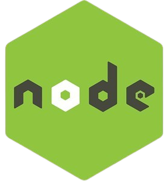
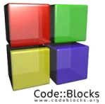
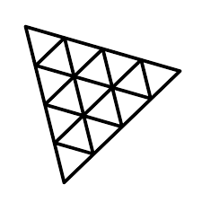

# Ciao, mi chiamo Francesco Ruocco 👋🏼

## Personal Information

- 🌍 I'm based in Naples
- 🎓 High school diploma Computer Science - I.T.I. Galileo Ferraris
- 💻 Junior Web Developer looking for an opportunity
- ​🌐​ My Curriculum https://francescoruocco10.github.io/my-curriculum/#Home

## Skills

### Software

  
  
  
  
  
  
  
  
  
  
  
  
  
  
  
  

### Languages

  
  
  
  
  
  
  
  

### Libraries

  
  

### Framework

  
  

### Data Format

  

